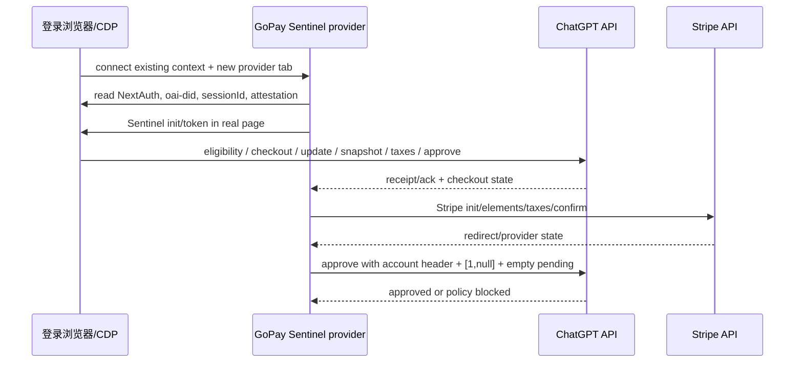

# GoPay 登录态与 approve 链路对齐报告

## 结论

本轮完成了三个账号的浏览器登录、NextAuth 绑定校验、Sentinel 生成和 GoPay
请求链路对齐。三个账号均通过 Playwright 输入密码与 TOTP 完成网页登录；运行时只
保留脱敏的槽位、布尔值、长度和阶段信息，不把 AT、密码、TOTP 或 Cookie 写入源码、
Git、日志或报告。

当前实现已经把最影响 `approve_blocked` 的三个协议差异修正为 canonical HAR 形状：

1. Checkout 创建成功后才加入 `chatgpt-account-id`，并在 snapshot/taxes/approve
   阶段持续携带。
2. `approve` 使用浏览器的字面量 `oai-telemetry=[1,null]`。
3. 收到的 `x-oai-is-receipt` 保留最近两个不同 receipt；第二次 taxes 才发送这两个
   receipt，随后 approve 回到空 pending envelope。

外部 CDP 模式还把 ChatGPT 的受保护请求改为由登录浏览器页发起，令 Cookie、设备、
UA、session id、代理出口和 Sentinel proof 处于同一上下文，避免 Roxy 浏览器出口与
HTTP 代理出口不一致导致的 proof/IP split。

## Evidence → Finding → Path

| Evidence | Finding | Path |
|---|---|---|
| 三个登录槽位均返回 ChatGPT 主界面，`/api/auth/session` HTTP 200 | 密码 + TOTP 登录态可以真实建立 NextAuth cookie；不能由 AT 单独伪造 | `artifacts-local/gopay-runtime/run-20260831-login-three/login-summary.json` |
| CDP `61908` external smoke：binding `matched`、account binding `1`、attestation 长度 `291`、SDK canonical `1` | 当前登录浏览器与目标 AT 的 user id/email 一致，Sentinel runtime 可复用 | `payment_link_extractor/gopay_sentinel_playwright.py` |
| canonical approve 的 account header 存在、telemetry 为 `[1,null]` | 旧实现漏掉阶段性 account header，并把 approve telemetry 错当成八字段 timing | `payment_link_extractor/gopay_checkout.py`, `payment_link_extractor/gopay_transport.py` |
| canonical taxes2 pending update 数为 `2` | 单 receipt 覆盖会丢状态；需要最近两个 receipt 的队列 | `payment_link_extractor/gopay_transport.py`, `payment_link_extractor/gopay_cs_live.py` |
| Roxy CDP 出口与用户代理池逐项 IP 不相同 | 仅切换 requests 代理不能让浏览器 proof 与 approve 同出口 | `payment_link_extractor/gopay_transport.py` 的 browser fetch bridge |
| 三个账号的历史完整尝试均到 `payment_confirmation → approve_blocked`，随后资格变为 `not_eligible` | 协议缺口与试用资格/服务端风控必须分开验证；本轮不再重复消耗已用资格 | `artifacts-local/gopay-runtime/run-20260831-login-three/*.log` |

## 登录态实现

### 浏览器侧

NextAuth 登录态由浏览器 Cookie jar 持有，关键材料包括分片的
`__Secure-next-auth.session-token.0/.1`、`__Host-next-auth.csrf-token`、
`__Secure-next-auth.callback-url`、`oai-did`、`_account` 及 Stripe 相关 Cookie。
Playwright 通过 CDP 连接现有浏览器时不清空或覆盖该 jar，而是在同一 context 新建
provider tab。

### 绑定侧

实现使用页面原生、无 Authorization header 的：

```text
GET /api/auth/session   (credentials: include, cache: no-store)
```

返回的 `user.id` 优先与 AT 的 `chatgpt_user_id` 比较，缺失时回退到邮箱比较；若
可读到 `_account` UUID，则同时检查 AT 的 account id。`/backend-api/me` 只用于独立
Bearer 校验，不能被当作 NextAuth 登录态证明。

### TOTP 登录的可复现要点

运行时从环境变量读取账号材料，不写入配置文件：

```powershell
$env:OPLL_GOPAY_SENTINEL_CDP_PORT = "61908"
$env:OPLL_GOPAY_EXTERNAL_CDP_BROWSER_HTTP = "true"
$env:OPLL_GOPAY_SENTINEL_NAVIGATE_CHECKOUT = "true"
```

TOTP URL 的首段是 Base32 secret。登录器在内存中按 30 秒窗口计算 RFC 6238
HMAC-SHA1 六位码，填入 Auth0 MFA 页面；页面完成跳转后只校验
`/api/auth/session` 的状态和邮箱布尔匹配，不保存验证码。

## GoPay 请求链路改动

### 外部 CDP browser fetch

当 `OPLL_GOPAY_SENTINEL_CDP_PORT` 有效时，ChatGPT host 的 eligibility、Checkout、
update、snapshot、taxes、redirect 和 approve 请求由 provider tab 的同源 `fetch`
发出。代码剥离浏览器禁止设置的 `Cookie/User-Agent/Sec-*` headers，让 Chromium
自动使用当前登录 Cookie、Roxy 指纹和真实出口；Stripe host 仍由独立 Stripe session
处理。

### 设备、session 与 attestation

从 `client-bootstrap` 读取 `webDeploymentAttestation` 和页面级 `sessionId`，并把
`oai-did`、`oai-session-id`、UA、Accept-Language、时区和 Client Hints 同步到 HTTP
transport。导入完整 Cookie state 时保留已有 `oai-did`，避免用 AT 派生 UUID 覆盖签发
attestation 的设备。

### Receipt 与 telemetry

```text
checkout       -> observation A, optional prior pending receipts
snapshot 1/2   -> observation B (同一 burst), pending 空
taxes 1        -> observation B, pending 空
taxes 2        -> observation C, 最近两个 receipt
approve        -> observation D, pending {"v":3,"updates":[]}, telemetry [1,null]
```

Stripe 浏览器 cookie 缺失时，`__stripe_mid`/`__stripe_sid` 使用 UUID36 + 六位小写
hex 后缀的 42 字符形状；AT-only、无 Cookie 的旧路径仍保留 `sid=NA`。

## 实测结果

### 登录与 Sentinel smoke

```text
CDP=127.0.0.1:61908
LOGIN_SLOTS=3/3
SESSION_HTTP_STATUS=200
EXTERNAL_CDP=1
SESSION_COOKIE_BINDING=matched
ACCOUNT_BINDING=1
SDK_SHA256_CANONICAL=1
ATTESTATION_LENGTH=291
DEVICE_ID_LENGTH=36
SESSION_ID_LENGTH=36
BROWSER_HTTP_ELIGIBILITY_REQUESTS=1
```

该 smoke 只做资格 GET 和 Sentinel 生成，不创建 Checkout；当前账号资格响应为
`not_eligible`，浏览器主 context 保持打开并返回 ChatGPT 主界面。

### 历史完整尝试（P0 修复前）

三个新账号中可用资格的尝试均完成：

```text
eligibility_check
→ eligibility_confirmed
→ checkout
→ checkout_committed
→ checkout_kind:stripe_checkout
→ checkout_browser_refresh
→ checkout_update
→ promotion_applied
→ stripe_init
→ elements_session
→ taxes
→ payment_confirmation
→ approve_blocked
```

这些尝试证明了浏览器登录和 Stripe/Sentinel 阶段可运行，但发生在 account header、
approve telemetry、receipt queue 和 browser-fetch 出口对齐之前；随后同一账号的
资格变为 `not_eligible`，因此不能用旧 AT 证明新实现的最终 approve 成功率。

## 验证命令

```powershell
& .venv\Scripts\python.exe -m pytest -q --disable-warnings --cache-clear
```

结果：`290 passed`，退出码 `0`。

静态协议核对同时确认：初始 checkout 不带 account header；checkout 响应之后的
snapshot/taxes/approve 带 account header；approve telemetry 为 `[1,null]`；第二次
taxes 携带两个 receipt；`oai-did` 和 `oai-session-id` 在一个 runtime 内保持稳定。

## 时序图



## 下一轮

下一轮只需提供新的、仍为 `eligible` 的 AT/账号材料；沿用 CDP `61908` 和同一
浏览器 profile，先执行 browser binding smoke，再执行一次完整 GoPay canary。已用
账号不再重试，避免把资格状态与协议修复混在一起。
