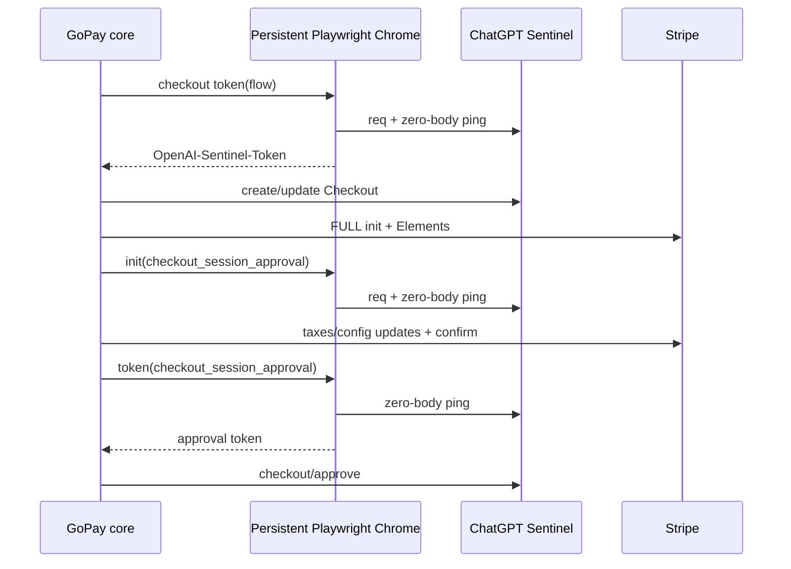

# GoPay 真 Playwright Sentinel 与四账号验证报告

## 结论

GoPay 已从 Node/DOM 模拟路径切换到 **Playwright 控制的真实 Chrome 151**。同一完整提链尝试现在复用一个守护线程、一个长期事件循环、一个持久 Chromium context 和一个按设备 ID 固定的本地 profile；`chatgpt_checkout` 与 `checkout_session_approval` 的 `init → token` 生命周期也在同一浏览器实例内连续执行。

四个新账号均按“资格代理等于提链代理、每个账号最多创建一次 Checkout”完成验证：三个账号进入最终 `checkout/approve` 后仍返回 `blocked`，第四个账号在创建并更新零元 Checkout 后于 Stripe init 遇到网络中断。没有账号被自动切换代理后创建第二个 Checkout。

真实浏览器证明链已验证成功，但三次 `blocked` 说明 **“改为真 Playwright”是必要条件，不是当前 AT-only 输入下的充分条件**。与两份成功 HAR 比较，剩余共同差异是：成功浏览器带有 NextAuth 登录态分片和 291 字符部署 attestation；本轮 AT-only profile 没有 session-token，attestation 长度为 0。

## 样本与范围

| 样本 | SHA-256 | 用途 |
|---|---|---|
| `gopay-cdp-capture-20260830-180333.har` | `14280D53DBC2C9E3AB901BDC0C43A007474211D1B017F06B4CF8ABE1E426A2FE` | 成功 GoPay approval/redirect 基线 |
| `gopay-cdp-capture-browser-targets-20260830-next.har` | `8DF5163E0A2D57598B257435C2449EA0371A236C6114BAE85234A94108547E50` | 第二份成功基线与稳定不变量 |

附件包含四个互不重复、可解析的 AT。报告只记录槽位和阶段，不记录 AT、Cookie、代理凭据、Checkout ID 或跳转 nonce。

## 原因分级

### 高概率且已修复

1. **Sentinel 运行环境**：弃用 GoPay 的 Node/jsdom/手工 DOM 证明路径；改为系统 Chrome 151 的真实 V8、DOM、iframe、fetch、Cookie 和 Resource Timing。
2. **Playwright 生命周期**：所有 Playwright API 只在专用 daemon 线程的持久 `ProactorEventLoop` 上执行，业务 worker 使用 `run_coroutine_threadsafe` 调度，避免 worker thread 内启动/销毁 Playwright。
3. **设备 profile**：`oai-device-id` 由 AT 稳定派生；Chrome user-data-dir 按设备 ID 固定并被 Git 忽略。
4. **Sentinel 顺序**：Checkout token 为 `req → zero-body ping → token`；approval 为 `init(req → zero-body ping) → Stripe confirm → token(zero-body ping) → approve`。
5. **Stripe init**：首包固定 FULL 版本并携带 `custom_checkout_server_updates_1` 与 `custom_checkout_manual_approval_1`。
6. **双 config ID**：confirm 顶层使用最终 payment-page `config_id`，嵌套 payment-method 使用 `/init` 初始 `config_id`。
7. **pending receipt**：回送 `x-oai-is-receipt`，不再错误回送 `x-oai-is-update`；ack 后清空。
8. **账号邮箱**：consumer lookup、taxes、confirm 使用当前 AT 的账号邮箱，不再复用静态邮箱。

### 中概率且已修复

- Elements 使用 `locale=id` 和 `browser_timezone=Asia/Jakarta`。
- 缺少 `__stripe_sid` 时发送 `sid=NA`。
- 地址/税费按成功 HAR 的五步字段和两轮 snapshot/taxes/page GET 时序执行。
- approval 使用版本化 frame 与精确 Checkout Referer。
- consumer lookup 使用 HAR 的 `Accept-Language: en`。
- Checkout 一旦真正发出，任务层禁止该账号的任何完整重试。
- Stripe init 网络中断现在只在**同一 Checkout、同一代理**内重试三次，不创建新 Checkout。

### 剩余高概率差异

两份成功 HAR 的 Sentinel/checkout/approve Cookie 均包含 `__Secure-next-auth.session-token.*`，且 checkout/approve 都携带同一份 291 字符 `oai-web-deployment-attestation`。本轮 AT-only Playwright profile 能生成真实 Sentinel token，但没有 NextAuth session-token，attestation 长度为 0。该差异与三个 `approve=blocked` 结果一致，是后续账号材料应补齐的首要字段。

## 真实浏览器证据

Playwright 生命周期探针观测到：

```text
PLAYWRIGHT_BROWSER_CHANNEL=chrome
PLAYWRIGHT_BROWSER_VERSION=151.0.7922.170
PERSISTENT_RUNTIME_ID_PRESENT=True
CHECKOUT_TOKEN_PRESENT=True
APPROVAL_TOKEN_PRESENT=True
SAME_RUNTIME_AFTER_TOKEN=True
SDK_SHA256=49d0284bf3eea8a59ebcad0e6b5dd8a53edd4c72606f15bbf51ebe5610a88efd
```

approval 稳定顺序：

```text
init:  /backend-api/sentinel/req(body>0, frame referer)
       /backend-api/sentinel/ping(body=0, checkout referer)
token: /backend-api/sentinel/ping(body=0, checkout referer)
```



## 四账号结果

| AT 槽位 | 固定代理槽位 | Checkout 次数 | 最后阶段 | 结果 |
|---:|---:|---:|---|---|
| 1 | 5 | 1 | `payment_confirmation` | `approve=blocked` |
| 2 | 5 | 1 | `payment_confirmation` | `approve=blocked` |
| 3 | 5 | 1 | `payment_confirmation` | `approve=blocked`；Chrome 151、持久 profile、精确 SDK 与 proof 顺序均生效 |
| 4 | 3 | 1 | `stripe_init` | 同代理网络中断；未进入 approve |

AT-3 的脱敏运行上下文确认：

- provider：`PlaywrightSentinelProvider`
- Chrome：`151.0.7922.170`
- 持久 runtime/profile：均为 `true`
- SDK SHA-256：与双 HAR 逐字节一致
- approval token：存在
- approval token ping：零长度、Checkout Referer
- pending updates：空封套
- Cookie：包含 `oai-did`、`oai-sc`、`__stripe_mid` 等，但不含 NextAuth session-token
- attestation：长度 `0`

## Evidence → Finding → Path

| Evidence | Finding | Path |
|---|---|---|
| E-001：真实 Chrome 151 生成 token，SDK SHA 与 HAR 一致 | Node/jsdom 不再参与 GoPay proof | `gopay_sentinel_playwright.py` |
| E-002：init/token 共用 runtime ID，事件顺序为 req/ping → ping | daemon/event loop/browser 生命周期已连续 | `gopay_transport.py` |
| E-003：双 HAR 的 FULL init 字段集合相同 | BASE-first 会漏 manual approval beta | `gopay_cs_live.py` |
| E-004：HAR 顶层/嵌套 config ID 来源不同 | 必须保存初始与最新两个 config ID | `gopay_stripe_common.py`、`gopay_cs_live.py` |
| E-005：HAR pending item 等于 receipt 而非 update | pending 字段来源已纠正 | `gopay_transport.py` |
| E-006：AT-1..3 仍 blocked，且均缺 session-token/attestation | AT-only 浏览器登录态仍与成功 HAR 不同 | 运行时输入与 Playwright profile |
| E-007：AT-4 在 Stripe init 网络中断 | 同 Checkout 内需要传输重试 | `gopay_cs_live.py` |

## 复验命令

```powershell
.\.venv\Scripts\python.exe -m pytest -q
.\.venv\Scripts\python.exe -m pytest -q tests\test_gopay_sentinel_playwright.py tests\test_gopay_isolated_optimization.py tests\test_extraction_full_retry.py
```
