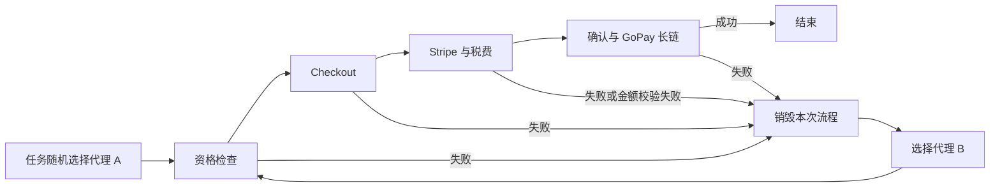

# GoPay 单次提链代理粘滞规则

## 结论

GoPay 现在强制执行“一个完整尝试只使用一个代理”。资格检查、Checkout 创建与更新、Stripe、税费、支付确认和 GoPay 长链解析全部绑定到本次尝试选中的同一代理。只有整个尝试失败，或开启金额校验后资格/金额检查失败，任务层才会选择下一个代理并从头创建新流程。



## 实现

- `payment_link_extractor/gopay_core.py` 在渠道入口将 `checkout_proxy` 固定为本次尝试代理，并把 `update_proxy` 及下游代理视图统一为该代理。
- `payment_link_extractor/web/tasks.py` 对 GoPay 的代理池和旧版双代理尝试列表都执行同一规则：同一次尝试的 checkout/update 代理必须相等。
- 重试仍由任务层执行；每次失败后重建浏览器、Checkout、Stripe 和 provider 状态，不在已开始的正常流程中热切换代理。

## Evidence → Finding → Path

| Evidence | Finding | Path |
|---|---|---|
| E-001：GoPay 代理池路径原本已让 checkout/update 在同一尝试相等 | F-001：需要把该约束提升为核心不变量 | `payment_link_extractor/web/tasks.py` |
| E-002：资格和 Checkout update 会读取 `update_proxy` | F-002：直接 API/旧配置仍可能在一次流程内切换代理 | `payment_link_extractor/gopay_checkout.py` |
| E-003：渠道核心持有所有下游调用的统一配置 | F-003：在 GoPay 核心入口钉住代理可覆盖资格、Checkout、Stripe 与 provider | `payment_link_extractor/gopay_core.py` |

## 验证

```powershell
.\.venv\Scripts\python.exe -m pytest -q `
  tests\test_extraction_full_retry.py `
  tests\test_gopay_isolated_optimization.py

.\.venv\Scripts\python.exe -m pytest -q
```

测试覆盖代理池随机重试、旧版 checkout/update 双列表输入、资格检查成功后的后续流程，以及金额校验失败后的下一次完整尝试。
