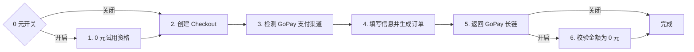

# GoPay 0 元试用与 0 元链接校验开关报告

## 结论

GoPay 网页入口新增了默认开启的“0 元试用与 0 元链接校验”开关。开启时执行资格检查与最终 0 元金额门禁；关闭时只跳过第 1、6 步，原有 Checkout 创建、GoPay 渠道检测、信息/订单生成和长链返回流程保持不变。



## 使用方式

1. 在网页中选择 `GoPay（印度尼西亚）`。
2. 保持开关开启，可执行完整的 1–6 零元流程。
3. 关闭开关，可跳过资格预检和最终零金额拒绝，非零金额的 GoPay 长链也能作为成功结果返回。

API 请求字段为布尔值：

```json
{
  "payment_method": "gopay",
  "gopay_zero_trial_validation": false
}
```

未提交该字段时默认开启；环境变量默认值可由 `OPLL_GOPAY_ZERO_TRIAL_VALIDATION=true|false` 配置。

## HAR 证据

指定样本：`artifacts-local/gopay-cdp-capture-browser-targets-20260830-next.har`

```powershell
.\.venv\Scripts\python.exe tools\har_cdp_gopay_summary.py `
  artifacts-local\gopay-cdp-capture-browser-targets-20260830-next.har `
  --output artifacts-local\gopay-zero-toggle-source-summary.json
```

脱敏解析结果：

- SHA-256：`8DF5163E0A2D57598B257435C2449EA0371A236C6114BAE85234A94108547E50`
- 记录数：`483`
- Checkout、Stripe init/elements/confirm、approve、redirect 和 Midtrans transaction 检查点齐全。
- Checkout 创建请求只有 `billing_details`、`checkout_ui_mode`、`entry_point`、`plan_name`，没有独立优惠资格请求。
- ChatGPT taxes 的权威 `amount_total=34900000`；Midtrans 显示 `gross_amount=349000 IDR`，该样本是可完整生成 GoPay 长链的非零流程。

## Evidence → Finding → Path

| Evidence | Finding | Path |
|---|---|---|
| E-001：HAR 中没有 `/promo_campaign/check_coupon`，但 2–5 所需检查点完整 | F-001：关闭开关时应从 Checkout 直接进入原有 2–5 流程 | `payment_link_extractor/gopay_core.py` |
| E-002：HAR 权威金额非零且仍到达 Midtrans 长链 | F-002：关闭开关时不得调用最终 `validate_gopay_amount` | `payment_link_extractor/gopay_core.py` |
| E-003：网页表单需要按 GoPay 渠道独立提交布尔值 | F-003：开关只在 GoPay 被选中时显示和提交 | `payment_link_extractor/web/templates/index.html`、`payment_link_extractor/web/static/app.js` |
| E-004：开启/关闭分支单元测试和全量回归通过 | F-004：PayPal、GoPay、GCash 的适配器和结果字段仍相互隔离 | `tests/test_gopay_isolated_optimization.py`、`tests/test_channel_isolation.py` |

## 实现路径

- `payment_link_extractor/models.py`：新增 `gopay_zero_trial_validation`，默认 `True`。
- `payment_link_extractor/web/routes.py`：解析并校验 API/环境变量布尔值。
- `payment_link_extractor/gopay_core.py`：只用该字段控制资格预检和最终 0 元门禁；Checkout update 和支付渠道生成流程不受影响。
- `payment_link_extractor/web/tasks.py`：新增最终金额校验进度阶段。
- `payment_link_extractor/web/templates/index.html`、`app.js`、`styles.css`：新增 GoPay 专属可见开关、提交字段和状态文案。
- `.env.example`：新增脱敏配置示例。

## 验证

```powershell
.\.venv\Scripts\python.exe -m pytest -q `
  tests\test_gopay_isolated_optimization.py `
  tests\test_gopay_support.py `
  tests\test_frontend_error_display.py

.\.venv\Scripts\python.exe -m pytest -q
```

验证覆盖：开启时资格检查和零金额校验阶段均执行；关闭时两阶段均缺席，`34900000` 的权威非零金额仍返回独立 `gopay_url`，中间 2–5 流程阶段完整执行。
