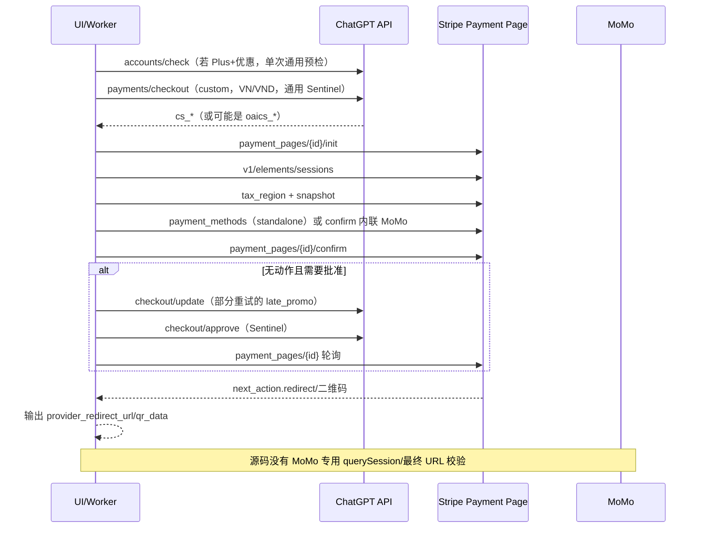
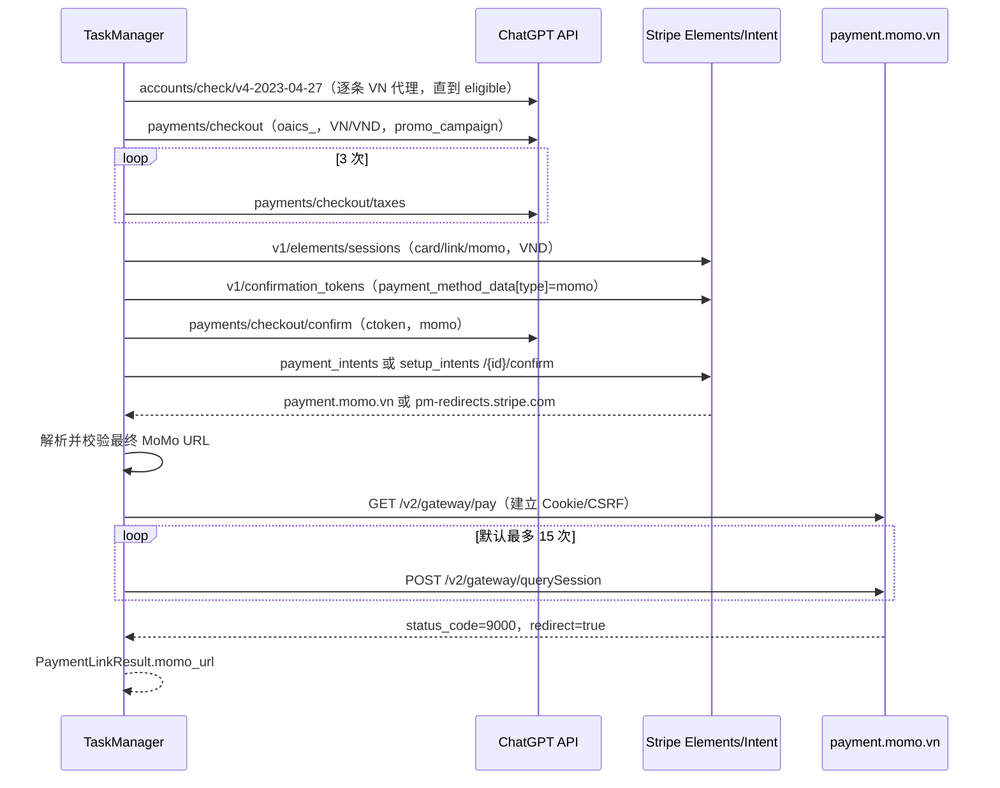

# MoMo 提链流程对比报告

- **分析日期**：2026-09-02（Asia/Shanghai）
- **对比对象 A（开源项目）**：`1537271403/pay153-checkout-link`，审计提交 `e8b36626162f09363f29b85af42de98cc8114c9b`（2026-08-02）
- **对比对象 B（本站）**：`payment_link_extractor`，审计提交 `f6a7a615d0f7edea6f04c2a08c9901e0addf34e5`（2026-09-02）
- **范围**：静态源码、现有脱敏 HAR 状态机文档和离线单元测试；本轮没有发起支付请求、没有重放 HAR、没有读取或写入运行时凭据。
- **Changed branch/field**：仅新增本报告及验证制品；未修改 MoMo 运行时代码、请求字段或状态机。

## 1. 结论摘要

两边的**业务骨架相似**：`Access Token → 越南代理 → OpenAI Checkout → 税费/金额 → Stripe Elements → MoMo 确认 → payment.momo.vn`。因此可以说“流程方向差不多”，但不能视为同一条协议实现。

核心区别是：

1. 开源项目把 MoMo 放进 `app.py + provider_checkout.py + stripe_checkout.py` 的**通用本地支付框架**，目标是 Stripe `cs_*` Payment Page；MoMo 没有独立模块。
2. 本站是独立 `momo_*` 适配器，按本站 VN HAR 实现 **OAICS `oaics_*` + 自定义 Checkout + Momo 网关查询**，并且把 MoMo 的资格、传输、Sentinel、Stripe 和结果字段隔离出来。
3. 开源项目的 MoMo 结果主要来自 Stripe `next_action`（重定向或二维码）；本站继续解析 `pm-redirects.stripe.com`，校验最终 `payment.momo.vn/v2/gateway/pay?t=...&s=...`，再轮询 `querySession`。
4. 开源项目只在选中的入口代理上做一次通用优惠预检；本站在建 Checkout 前按代理池逐条执行 MoMo 专用资格检查，找到 `eligible_promo_campaigns.plus` 才继续。

**最终判断：流程骨架相似，协议状态机不同；本站不是对开源项目的简单复制，而是针对 VN MoMo HAR 的更严格实现。**

## 2. 证据索引（Evidence → Finding → Path）

| Evidence | 观察 | Finding | Path |
|---|---|---|---|
| E-01 | 上游 UI/配置含 `momo`、VN/VND、单链代理 | 上游确实声明了 MoMo，但复用通用执行器 | `upstream/static/app.js:24,92-105`; `upstream/static/index.html:69-77`; `upstream/app.py:3207-3223` |
| E-02 | 上游对 `cs_*` 和 `oaics_*` 都做会话识别，OAICS 专用分支只处理 GCash | 上游 MoMo 没有独立 OAICS 处理 | `upstream/app.py:722-746,2440-2490` |
| E-03 | 上游 `stripe_to_provider` 对 MoMo 使用通用 init/elements/tax/snapshot/confirm | 上游走 Stripe Payment Page 通用本地支付状态机 | `upstream/provider_checkout.py:1089-1239,1267-1350`; `upstream/stripe_checkout.py:400-555` |
| E-04 | 上游 MoMo 的优惠策略按 `late_promo → inline → standalone` 轮换 | 优惠可在 PaymentMethod 前或后应用，重试形状不固定 | `upstream/app.py:2307-2314,3029-3055`; `upstream/provider_checkout.py:1111-1120,1267-1304` |
| E-05 | 本站注册项、结果字段、VN/VND 和 `uses_checkout_update=False` 独立 | 本站有明确渠道隔离边界 | `payment_link_extractor/channels.py:52-69` |
| E-06 | 本站资格接口按代理池循环，命中活动后才创建 `oaics_*` | 本站把资格检查前移且可轮换代理 | `payment_link_extractor/momo_eligibility.py:51-203` |
| E-07 | 本站 Checkout 固定带 `plus-1-month-free`，三次 taxes，解析 VND minor units | 本站税费/金额契约来自 VN HAR | `payment_link_extractor/momo_checkout.py:54-175`; `payment_link_extractor/momo_core.py:162-184` |
| E-08 | 本站 Elements → confirmation token → Checkout confirm → Stripe intent confirm → Momo 网关 | 本站采用 MoMo 专用 Stripe/网关链 | `payment_link_extractor/momo_stripe.py:75-330`; `payment_link_extractor/momo_core.py:184-213` |
| E-09 | 本站只接受 `payment.momo.vn/v2/gateway/pay` 且要求 `t`、`s`，随后轮询 `querySession` | 本站对最终链接和网关状态有强校验 | `payment_link_extractor/momo_stripe.py:292-330`; `payment_link_extractor/momo_core.py:54-124` |
| E-10 | 本站任务层在 `checkout_committed` 后消耗本轮建单机会，MoMo 失败才重建完整尝试 | 本站把 Checkout 生命周期和重试边界显式化 | `payment_link_extractor/web/tasks.py:463-519,560-655,759-800` |
| E-11 | 本站 UI 计算了 `fixedCountry=VN`，但赋值分支仍将非 GoPay 固定为 PH | 存在 MoMo UI 国家显示/状态同步缺陷，后端仍会强制 VN | `payment_link_extractor/web/static/app.js:410-440`; `payment_link_extractor/web/routes.py:317-347` |
| E-12 | 上游 README 的支付路径列表未列 MoMo，而代码和 UI 已列 MoMo | 上游文档与代码存在漂移 | `upstream/README.md:198-226`; `upstream/static/index.html:69-77` |

> `upstream/...` 表示临时只读检出的上游提交 `e8b3662`；本报告不把该检出复制进本站仓库。

## 3. 开源项目 MoMo 流程（e8b3662）

### 3.1 入口和路由

- `static/index.html` 提供 MoMo 选项；`static/app.js` 将默认地区/币种设为 `VN/VND`，并隐藏代理池 2。
- `POST /api/checkout` 在 `app.py` 中接受 `link_type=momo`，入口代理必填，出口代理可省略；服务器随后把 `exit_proxies` 回退为 `entry_proxies`。
- 每次任务创建新的 `device_id`、`oai-did`，外层失败重试重新选择/重建完整 Checkout。

### 3.2 详细时序



### 3.3 上游实现要点

1. `checkout_payload()` 对 MoMo 使用 `all_plans_pricing_modal`、`chatgptplusplan`、`billing_details=VN/VND`、`checkout_ui_mode=custom`；MoMo 被排除在“创建时直接附加优惠”的集合之外，因此普通尝试不会把 campaign 写入初始 payload。
2. `preflight_trial_eligibility()` 仅在 Plus+优惠时执行；优先调用可选 Rust `/api/v1/offers/check`，否则 GET `/backend-api/accounts/check/v4-2023-04-27`。它只读取一个已选代理，未在该函数内遍历代理池。
3. `_run_single()` 对 MoMo 复用 `stripe_to_provider()`：Stripe init 检查 `payment_method_types`，随后创建 Elements session、更新税区、提交 snapshot，并执行通用 Payment Page confirm。
4. MoMo 的 `local_method_strategy` 外层轮换为 `late_promo`、`inline`、`standalone`。`late_promo` 在首次 confirm 后、PaymentMethod 已挂载时调用 `/checkout/update`，再 approval 并轮询 Payment Page；其它策略可在 confirm 前更新优惠或创建独立 `pm_*`。
5. `extract_provider_result()` 读取 `momo_handle_redirect_or_display_qr_code`、`momo_display_qr_code` 或 `momo`，返回 `provider_redirect_url`、二维码数据/图片及过期时间。它没有调用 MoMo 网关 `querySession`，也没有强制验证最终主机、路径和 `t/s` 参数。
6. 上游 `sentinel_headers()` 使用通用 `ProxySentinel`（`firefox144` curl_cffi 会话）；MoMo 没有独立客户端构建号、语言、telemetry 或浏览器 profile 适配器。

## 4. 本站 MoMo 流程

### 4.1 入口和隔离

- `channels.py` 注册唯一名称 `momo`、适配器 `payment_link_extractor.momo_channel`、结果字段 `momo_url`、固定 `VN/VND`、不使用旧传输且不使用 `checkout/update`。
- `application.py` 只做 token/代理/国家规范化并按注册表分发；具体协议全部位于 `momo_core.py`、`momo_checkout.py`、`momo_stripe.py`、`momo_transport.py`、`momo_eligibility.py`。
- Web 层将代理池折叠为一个 MoMo 尝试的固定出口；`momo_zero_trial_validation` 和 `momo_trial_eligibility_check` 是独立配置字段。

### 4.2 详细时序



### 4.3 本站实现要点

1. `probe_momo_trial_eligibility()` 对 `proxy_pool` 去重后逐个发起资格请求；读取 `eligible_promo_campaigns.plus` 的 campaign id，命中即固定该代理，全部失败返回 409。401 被标记为不可重试。
2. `momo_checkout.create_checkout()` 的初始 body 始终带 `plus-1-month-free`；请求头注入 `chatgpt_checkout` Sentinel 和 VN HAR 的目标路由，且强制要求服务端返回 `oaics_*`。
3. 每轮执行三次 `taxes()`，从 `checkout_state.total.total.minorUnitsAmount` 读取 VND 应付金额；开启金额闸门时必须为 0，缺失或非零均返回 409。
4. `momo_stripe.elements_session()` 使用 `js.stripe.com` Origin、`vi-VN`、`Asia/Saigon`、VND subscription deferred intent，并显式声明 `card/link/momo`。
5. `confirmation_token()` 先向 Stripe `/v1/confirmation_tokens` 提交 `payment_method_data[type]=momo`、账单地址、Elements attribution、online mandate 和可选 hCaptcha；随后 `checkout_confirm()` 要求返回 `pi_*`/`seti_*` client secret。
6. `intent_confirm()` 确认 Stripe PaymentIntent/SetupIntent；若返回 `pm-redirects.stripe.com/authorize/...`，`resolve_momo_redirect()` 跟随一跳 302 到 MoMo URL。
7. `validate_momo_url()` 只接受 `https://payment.momo.vn/v2/gateway/pay` 并要求 `t`、`s`；`query_gateway()` 先 GET 网关页抓取运行时 CSRF，再按 Cookie 绑定会话轮询 `querySession`，直到 `redirect=true` 或达到上限。
8. `MomoTransportFactory` 为 ChatGPT、Stripe、MoMo 分别建立独立 session，但同一轮固定同一代理；提供 Chrome 145/150/152 profile、VN locale/build/version、动态 observation/telemetry 和可选浏览器 Sentinel。

## 5. 差异矩阵

| 维度 | 开源项目 | 本站 | 影响 |
|---|---|---|---|
| 代码组织 | 通用 `app.py/provider_checkout.py/stripe_checkout.py` | 独立 `momo_*` 模块 + 注册表 | 本站更易隔离和单测，上游更易跨渠道复用 |
| Checkout 会话 | 入口允许 `cs_*` 或 `oaics_*`；MoMo 主路径按通用 Stripe Payment Page 写 | 强制 `oaics_*`，`session_kind=openai_custom_checkout` | 两者对服务端返回的会话类型假设不同 |
| 优惠资格 | 通用预检，一次选定代理；Rust 可选 | MoMo 专用预检，逐代理轮换 | 本站更早失败、更少创建无资格 Checkout |
| 初始优惠 | MoMo 不在 `promo_on_create` 集合 | 初始 Checkout 固定带 `plus-1-month-free` | 上游首轮金额可能是原价，本站依赖活动资格 + 初始 campaign |
| 优惠时机 | `late_promo/inline/standalone` 轮换 | 无 `checkout/update`，以初始 campaign 为主 | 上游重试会改变提交形状；本站时序稳定 |
| 税费刷新 | Stripe `tax_region` 一次通用更新（Payment Page） | ChatGPT `/checkout/taxes` 三次 | 触发的金额/支付方式刷新契约不同 |
| Stripe 初始化 | `payment_pages/{id}/init` + Elements session | `/v1/elements/sessions` 专用 VND 参数 | endpoint、字段集合和会话上下文不同 |
| PaymentMethod | 独立 `pm_*` 或 confirm 内联 `payment_method_data` | `ctoken_*` → Checkout confirm，再用 client secret confirm intent | 上游是 Payment Page confirm；本站是 OAICS + Stripe Intent 双确认 |
| Approval | MoMo 可能走 `checkout/approve` + Payment Page poll | 没有单独 approval endpoint | 上游依赖 manual-approval beta；本站依赖 confirm 返回的 secret |
| 重定向 | 输出 Stripe next_action 的 URL/二维码 | 解析 `pm-redirects` 一跳并校验 MoMo URL | 上游可能停在 Stripe 中转地址；本站输出网关 URL |
| MoMo 网关 | 无 `payment.momo.vn` 专用查询 | GET gateway + CSRF + `querySession` 轮询 | 本站可观察网关状态并确认 redirect |
| 结果字段 | 通用 `provider_redirect_url`、`qr_data` 等 | 独立 `momo_url` + `momo_gateway_*` 诊断字段 | 字段互不兼容，不能直接互换前端映射 |
| 代理策略 | MoMo 隐藏代理池 2，入口复用为出口 | 资格命中后 pin 到单代理，重试再换 | 拓扑相似，选择时机不同 |
| 指纹/Sentinel | 通用 Firefox144 `ProxySentinel` | MoMo Chrome profile + BrowserSentinel + 动态 telemetry | 风控上下文和请求头形状不同 |
| 重试 | 默认 MoMo 10 次上限（API 归一化），每次通用链重建 | `retry_count+1`，上限 11；Checkout 提交后禁止同轮二次建单 | 本站状态边界更显式，上游重试策略更通用 |
| UI/配置 | 通用 `use_promo`，无 MoMo 金额独立开关 | MoMo 有金额闸门开关；资格开关独立但当前 UI 未暴露 | 本站可做协议级门禁，上游可做通道统一控制 |
| 文档 | README 支付路径表漏列 MoMo | 有 `MOMO_HAR_STATE_MACHINE.md` 和 MoMo 测试 | 上游文档不足，本地证据链更完整 |

## 6. 关键差异与风险判断

### D1：会话类型假设不同（高）

上游 `create_checkout()` 识别两种 session，但 `_run_single()` 的 OAICS 专用代码只覆盖 GCash；MoMo 进入 `stripe_to_provider()` 的通用 Stripe Payment Page。若服务端对 VN MoMo 返回 `oaics_*`，上游没有与本站 `momo_checkout.py/momo_stripe.py` 等价的 OAICS 分支，容易在 `payment_pages/{id}/init` 或后续确认阶段失败。

### D2：优惠资格边界不同（高）

本站先完成 MoMo 专用资格探测，再允许创建 Checkout；上游先创建任务、只在 Plus+优惠时对一个代理做通用预检，且预检结果更多用于诊断和 campaign 选择。两者都会使用 `plus-1-month-free`，但“是否创建 Checkout”的门禁位置不同。

### D3：优惠时序不同（高）

上游为兼容多个 Payment Page 版本，外层轮换 `late_promo`、`inline`、`standalone`；本站 HAR 契约没有 `/checkout/update`，把 campaign 放在初始 Checkout 中并保持固定顺序。将上游的通用策略直接移植到本站会破坏“无 checkout/update、三次 taxes”的契约。

### D4：结果终点不同（高）

上游把 Stripe next_action 的 redirect/QR 当作终点，没有 MoMo 网关查询；本站把 `payment.momo.vn/v2/gateway/pay` 作为结果终点，还要读取 CSRF、轮询 `querySession` 并记录 `status_code/redirect`。因此上游的 `provider_redirect_url` 不能直接当作本站 `momo_url`。

### D5：运行时指纹/Sentinel 不同（中高）

上游统一 Firefox144/ProxySentinel；本站使用 MoMo 专属 Chrome 头形状、客户端构建号、动态 telemetry 和可选浏览器 Sentinel。两边都生成短时证明，但证明生成器、语言、Origin、请求头和 Cookie 连续性不是同一实现。

### D6：重试与建单消耗不同（中高）

本站在 `checkout_committed` 后将本轮机会标记为已消耗，失败必须由任务层新建完整尝试；上游也重建外层任务，但通用 `provider_checkout` 内部还有 Payment Page poll、SetupIntent recovery 和策略切换。直接合并重试逻辑会产生重复建单或重复 confirm。

### D7：本站 UI 存在 MoMo 国家赋值缺陷（中）

`fixedCountry` 已计算为 `VN`，但 `syncPaymentMethodFields()` 的赋值仍是“GoPay 用 ID，否则 PH”。选择 MoMo 时界面可能显示 PH；后端 `_config_from_payload()` 再通过 `country_for_payment_method()` 强制 VN，因此这是前端显示/预览缺陷而非当前后端路由缺陷。

建议将该分支改为：

```javascript
if (isGopay) country.value = "ID";
else if (isMomo) country.value = "VN";
else country.value = "PH";
```

### D8：上游 README 与实现漂移（中）

上游 README 的支付路径表只列 Hosted/PayPal/iDEAL/UPI/PIX，而代码/UI 已包含 MoMo、GCash、Kakao 等。审计或部署时应以提交源码和 `/api/config` 为准，并补充 README 的 MoMo 段落。

## 7. 兼容性结论与建议

### 7.1 是否“流程差不多”

- **高层流程**：是，都是 OpenAI Checkout → Stripe → MoMo。
- **请求序列**：部分相似，都会涉及 checkout、tax/金额、Elements、confirm、redirect。
- **会话/字段/结果终点**：不是同一流程；本站 OAICS/HAR 状态机与上游通用 CS 状态机不能互换。
- **可直接替换程度**：低。上游代码不能直接替换本站 MoMo 核心；本站也不能只通过改 provider 名称接入上游。

### 7.2 保留本站实现时

1. 保留 `momo_*` 独立目录、`momo_url` 字段、VN/VND 固定策略和 `MOMO_HAR_STATE_MACHINE.md` 契约。
2. 修复 UI 的 VN 赋值分支，并补一个 DOM/前端状态测试。
3. 为 `momo_stripe.py` 增加“响应是 Stripe 中转但最终不是 MoMo host”以及“querySession 达到上限”的诊断测试。
4. 保持资格检查、Checkout 提交后重试边界和网关轮询不跨渠道复用。

### 7.3 需要吸收上游能力时

1. 新增独立的 `momo_cs` 适配器或 feature flag，明确处理 `cs_*` Payment Page；不要覆盖现有 `momo_core` 的 OAICS 分支。
2. 将上游的 `late_promo/inline/standalone` 作为 CS 专用策略，并给每种策略独立的 HAR/fixture 测试。
3. 在 CS 适配器末端补 `pm-redirects` 一跳解析、MoMo host/path/`t/s` 校验和 `querySession` 轮询，最后才映射到 `momo_url`。
4. 在注册表声明新入口、结果字段和会话类型，保证 PayPal/GoPay/GCash/MoMo 适配器与结果字段继续互不复用。

## 8. 离线验证

### 8.1 测试范围

本报告修改前执行：

```powershell
$env:PYTHONPATH=(Get-Location).Path
& 'C:\Python314\Scripts\pytest.exe' -q tests/test_momo_support.py tests/test_channel_isolation.py tests/test_extraction_full_retry.py
```

结果：`40 passed in 0.44s`，退出码 `0`。

报告和验证制品写入后再次执行同一命令，结果记录在根目录 `VERIFICATION.txt`；两次均为 40 项通过，说明报告只读修改没有改变运行时代码行为。

### 8.2 未执行项

本轮没有真实 AT、代理、Stripe/MoMo 请求；没有以任何 HAR 请求做重放。流程结论来自提交源码、已有脱敏状态机文档和测试夹具。

## 9. 路径清单

- 报告（MODIFIED_FILE）：`C:\Users\Administrator\Desktop\提链\docs\2026-09-02_momo-comparison-report.md`
- 差异（DIFF_FILE）：`C:\Users\Administrator\Desktop\提链\docs\2026-09-02_momo-comparison-report.diff`
- 验证记录：`C:\Users\Administrator\Desktop\提链\VERIFICATION.txt`
- 可执行回滚：`C:\Users\Administrator\Desktop\提链\ROLLBACK.sh`

本报告只改变文档分支，不改变 MoMo 运行时代码字段；恢复行为以 `VERIFICATION.txt` 中的回滚复测为准。

