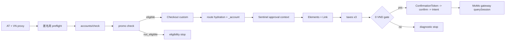

# MoMo VN 深度提链优化报告

## 摘要

本轮以本机完整 MoMo HAR 为事实基准，并对照看雪 Stripe Custom/Hosted 协议分析，修正了 OAICS Custom 路线的请求顺序、会话连续性、Stripe 参数、Sentinel 生命周期和 MoMo 网关状态机。当前再评估将 AT-only 作为一等路线，`status=blocked` 只视为服务端审批结果，不把它单独归因于 NextAuth `session-token`。运行时仍严格区分 MoMo 与 PayPal、GoPay、GCash。

看雪[深度提链分析](https://bbs.kanxue.com/thread-292557.htm)明确指出：HAR 中真实浏览器发出的字段、顺序、编码和时序优先于旧文档；`oaics_*` Custom 路线使用 Elements、ConfirmationToken、平台 Confirm 和 Stripe Intent Confirm，且 Custom 使用短 `_stripe_version`、双层 attribution、42 字符指纹和完整 Cookie 隔离。



## Evidence → Finding → Path

| Evidence | Finding | Path |
|---|---|---|
| HAR 1217 entries；审计关键节点完整 | 真实路线是 `backend-anon 壳 → accounts/check → promo check → checkout → Sentinel approval prefetch → Elements → taxes×3 → confirmation_tokens → checkout/confirm → setup_intents/confirm → pm-redirects → MoMo gateway → querySession` | `artifacts-local/momo-roxy-mitm-20260902-023932.har` |
| Checkout body 含 `promo_campaign`，税费地址逐步变化 | 初始优惠和三次税费请求必须保持同一 OAICS session | `payment_link_extractor/momo_checkout.py` |
| Checkout、taxes、confirm 共用 device/session；taxes/confirm 才出现 account header | 资格探测不能关闭后重新创建 ChatGPT session | `payment_link_extractor/momo_eligibility.py`, `momo_core.py`, `momo_transport.py` |
| Elements 先于 taxes；SetupIntent Confirm 使用短版 Stripe 版本和两项 attribution | 原先的调用顺序、版本和字段集合会改变 Custom 路线 | `payment_link_extractor/momo_core.py`, `momo_stripe.py` |
| `__stripe_mid/__stripe_sid` 在 taxes Cookie 与 ConfirmationToken 的 `muid/sid` 相同 | Stripe 浏览器 ID 必须跨 ChatGPT/Stripe session 同步 | `payment_link_extractor/momo_stripe.py` |
| gateway HTML 使用 `<meta name="_csrf">`；querySession 空 body、约 4.25 秒轮询 | 需要独立的文档导航头、XHR 头、CSRF 提取和终态闸门 | `payment_link_extractor/momo_transport.py`, `momo_core.py` |
| 历史 AT-only canary 的 Confirm 返回 `{status: blocked}`；canonical HAR 同时出现 pending receipt、telemetry、Sentinel、attestation 和 hCaptcha 动态材料 | `blocked` 只证明审批分支未返回 client secret；首要缺参候选是运行时 pending-updates/挑战材料，而不是固定登录 Cookie | `artifacts/momo-har-canary-20260902/VERIFICATION.txt`、MoMo transport 和本报告“再评估” |
| 本轮新 AT 复测中进入 promo 的样本均在 account check 得到 HTTP 200，但 promo 返回 `state=not_eligible` | 当前样本没有进入 Checkout，因而不能用本轮结果判断 Confirm 或 `session-token` | 本报告“真实测试” |

## 高/中/低概率原因

概率口径按失败所在阶段区分：资格阶段的 `not_eligible` 与提交后的 `status=blocked` 是两个不同服务端分支，不能用同一项上下文缺失解释。

### 高概率

1. **当前资格阶段的活动状态**：本轮 account check 为 HTTP 200 而 promo 为 `state=not_eligible`，最直接的解释是该 AT/出口在本次服务端活动判定中没有可用 campaign；兑换状态、目录匹配或活动窗口变化只是待响应字段验证的候选。这是资格结果，不是网络失败或登录 Cookie 结论。
2. **历史 blocked 阶段的 Sentinel approval proof 与 telemetry 时序/配对**：资格阶段预热、Checkout route-data 后刷新 `chatgpt_checkout`，再预取 `checkout_session_approval`，并在同一 device/session/proxy 上复用；诊断同时核对 proof、`oai-telemetry` 和 pending envelope。
3. **当前 Stripe hCaptcha token 与 fraud challenge 是独立动态输入**：成功 HAR 的 ConfirmationToken 请求含 `payment_method_data[radar_options][hcaptcha_token]`，并伴随浏览器生成的 fraud telemetry；代码只接受参数、环境或同一 Elements 响应中的新 token，不重放 HAR 值。字段缺失时记为 `payment_challenge_missing` 候选，不归类为登录 Cookie 问题。
4. **pending-updates 收据链此前未在 MoMo HTTP 层闭环**：成功 HAR 的 promo/checkout 请求携带由前序 `x-oai-is-receipt` 组成的 v3 envelope；MoMo 原先只初始化空 envelope，未消费响应收据。现已在 AT-only 会话中运行时累积、去重并在后续请求发送。
5. **Checkout route hydration 的 `_account` 路由 Cookie 可能未完成**：canonical `.data` 响应设置与 AT 对应的 36 字符 account routing Cookie；当前 AT-only 路线先预置同值，再尝试读取 `.data` 的实时更新并同步到浏览器。本轮探针收到 202 登录重定向，因此该项仍是待差分的路由上下文候选，而不是已证实根因；它不是 NextAuth session-token。

### 中概率

- 过期/错误的客户端构建号、locale、Stripe Origin、Accept-Language、telemetry；或 `x-oai-is-receipt` ACK 与下一请求 envelope 的边界处理。
- `muid/sid` 与 Stripe Cookie 不一致。
- `stripe_js_id` 与 ConfirmationToken/Link lookup 的 client session ID 不一致。
- canonical HAR 在 authenticated 壳之前还有 `/backend-anon/accounts/check`、`/backend-anon/me`、`/backend-anon/checkout_pricing_config`；AT-only 实现若跳过该匿名壳，需作为独立顺序变量验证，不能直接当作登录 Cookie 缺失。
- AT-only 浏览器 backend 注入与 target route 的对应关系；GCash 以 Bearer AT 在每个 ChatGPT backend 请求边界注入账号、设备、会话和 target path，MoMo 现在在专属 init bridge 中采用同一语义，Sentinel endpoint 单独保留。
- querySession 过早轮询、CSRF meta 名称未识别、把未终态网关状态误当成功。
- `pm-redirects` 自动跟随造成 Stripe session 提前请求 MoMo 页面。

### 低概率

- Chrome 具体小版本本身；当前默认在 136/145/146/150 中随机，但单次尝试内固定一个 profile。
- Elements 请求参数顺序；已按 HAR 将 customer session secret 放到查询串前部，但服务端通常按语义解析。

## 再评估：AT-only 参数优先级

本站 GCash 上游证明，AT 可直接作为 `Authorization: Bearer` 驱动平台 API；其代码不读取 NextAuth `session-token`、账号密码或 OAuth callback。MoMo 因而也不再把 NextAuth Cookie 视为必填前置条件。MoMo 的 `status=blocked` 是一个结果状态，根因必须通过同一轮请求的动态参数快照继续区分：

1. `x-oai-is-pending-updates` 是否包含本轮实时 receipt；
2. `OpenAI-Sentinel-Token` 是否来自当前 approval flow；
3. `oai-telemetry` 是否为当前请求生成且与 flow 配对；
4. Elements 的 site key、rqdata 与当前 hCaptcha token 是否同轮；
5. `guid/muid/sid`、Elements session/config、checkout ID 和金额是否一致。

NextAuth 状态只作为可选运行时材料记录，不再作为 `blocked` 的默认解释。

## 已落地的路线优化

- 初始 Checkout 固定携带 VN trial campaign，Referer 与 HAR 一致。
- Checkout 后补齐 `.data?_routes=routes/checkout.$entity.$checkoutId` route hydration，并消费响应中的 `_account` routing Cookie；AT-only 浏览器 bridge 对 ChatGPT backend fetch/XHR 注入 Bearer AT 与设备/会话头，Sentinel endpoint保持独立。
- Hydration 诊断保存 `status`、尝试次数和 `redirect_to_login`；AT-only jar 会清理从浏览器导入的旧 auth/OAuth 分片，并移除会遮蔽实时 `_account` 的固定 `Cookie` 快照。
- 浏览器 AT bridge 同时补齐受保护 checkout 阶段的 deployment attestation 和缺省 v3 pending envelope；`.data` 路由继续排除这些 API 头。
- `Elements` 移到三次 taxes 之前；taxes 使用空 state/postal → state → 完整 postal 的渐进地址，保留无 `line2`、无 `tax_id` 的 HAR body 形状。
- Elements 后按 HAR 补齐 `link/get-cookie` 与三次 Stripe consumer lookup；lookup 使用 canonical 的 `Accept-Language: en`，Elements、lookup 和 ConfirmationToken 统一复用 `stripe_js_id`/client session ID，并优先采用实时 `payment_method_types` 顺序。
- Stripe API/merchant-ui 会话保持无 Cookie；`__stripe_mid/__stripe_sid` 仅在 ChatGPT Cookie 与 ConfirmationToken 的 `muid/sid` 字段之间同步。
- 资格探测可保留 ChatGPT session；账号 header 只在 taxes/confirm 路由注入。
- Stripe Custom Intent Confirm 改用 `2025-03-31.basil`，只发送 `client_session_id` 和 `merchant_integration_source=l1` 两项顶层 attribution。
- `muid/sid` 与 ChatGPT、Stripe 两侧 Cookie 同步；`guid` 保持独立的新 42 字符值；`time_on_page` 默认约 20 秒并可运行时覆盖。
- 新增 MoMo 专属增强 Sentinel：真实 ChatGPT origin、SDK init script、VN timezone、approval `prepare_flow`、Cookie/receipt/attestation 同步、动态八元 telemetry。
- 新增 MoMo 专属 pending receipt 闭环：HTTP 响应和浏览器 monitor 的 `x-oai-is-receipt` 进入有界 v3 envelope；不回显 `x-oai-is-update`，并把实时队列数量纳入 confirm 诊断。
- 浏览器 monitor 的 receipt 镜像在 Checkout 创建后才启用，并先标记启动壳已有 receipt；首个 AT account check 保持空 pending envelope，Checkout 响应边界显式消费预检队列。
- 资格探测先复现 canonical 的三个只读 `/backend-anon/*` 壳请求（可用 `OPLL_MOMO_ANON_PREFLIGHT=false` 关闭），再进入 Bearer AT 的 authenticated 检查。
- 浏览器启动避免 about:blank 抢占活动 tab；导航 init script 放在 URL 后，避免 agent-browser 把 SDK 注入到错误页面。
- Gateway GET 使用文档导航头；querySession 使用空 body、`Accept: */*`、CSRF 和 4.25 秒默认间隔；只有 `status_code=9000 && redirect=true` 才产生成功结果。
- UI 选择 MoMo 时固定显示 VN，并可选择或随机轮换支持的浏览器 profile。
- 支持可选地从导入 JSON/Cookie header 重组 NextAuth session-token 分片；AT-only 主路线直接使用 Bearer AT，并支持 `OPLL_MOMO_SESSION_TOKEN`、`OPLL_MOMO_BROWSER_PROFILE_DIR`、`OPLL_MOMO_STRIPE_HCAPTCHA_TOKEN` 作为运行时增强输入。

## 真实测试

本节只记录本轮运行时观测，不把资格失败改写成 Confirm 失败，也不把任何结果归因于 `session-token`。AT、代理、Cookie、订单标识和响应中的 opaque 值均只在进程内使用，未写入报告。
记录时间：2026-09-03（Asia/Shanghai）。

### 新 AT 的资格阶段

在 `momo_trial_eligibility_check=True` 下，本轮抽测中进入 promo 流程的每个新 AT 都出现同一前置结果：

| 阶段 | 观测 | 结论 |
|---|---|---|
| account check | HTTP 200（已观测样本） | Bearer AT 可到达账号检查接口 |
| promo check | `state=not_eligible` | 当前 AT/出口组合未被服务端判定为该活动资格 |
| Checkout | 未创建 | 没有进入 Elements、taxes、Confirm 或网关 |

因此，本轮新 AT 样本不能用于判断 `checkout/confirm` 的 `status=blocked`，也不能证明缺少任何固定 Cookie。应先取得服务端返回 `eligible` 的新资格样本，再比较后续动态上下文。
对已观测样本而言，account HTTP 200 说明请求已通过基础传输与 AT 识别；`not_eligible` 是 promo 资格结果，不能直接归因于代理连通性或 `session-token`。
同轮新增匿名壳三个请求均返回 HTTP 200，authenticated pricing/settings 也返回 HTTP 200（`payments/payment_methods` 返回 422）；这些状态只作为顺序/能力观测，未改变 promo 的 `not_eligible` 判定。

### 下游线路探针（仅为定位，不是成功尝试）

为验证资格之后的代码路径，2026-09-03 另一次真实探针显式关闭了资格闸门但仍保持 `momo_zero_trial_validation=True`；该设置不代表生产路线放行资格。探针观察到：

1. Checkout 已创建并提交；
2. `.data` hydration 返回 HTTP 202 的登录重定向内容，带当前 Bearer/设备/会话头的重试仍未获授权，诊断中的 `redirect_to_login=true` 与 `ok=false` 保持一致；
3. 随后完成 customer-balance、Sentinel refresh/approval、Elements、Link 初始化和 taxes×3；
4. 权威金额为 `522500` VND minor units，0 元闸门按设计在 Confirm 前停止；
5. 没有调用可确认的 Confirm，也没有产生 `momo_url`；本次完整探针在 `zero_amount_validation` 退出，耗时约 79.5 秒。

这个结果只说明当前样本不是 0 元资格，且 hydration 授权状态需要继续观测；它不是 `status=blocked`，更不是 `session-token` 缺失的证明。

### 历史对照 canary

已归档的 `artifacts/momo-har-canary-20260902/VERIFICATION.txt` 记录了另一组当时通过资格预检的 AT：其中 4 个槽位到达 `zero_amount_confirmed` 后收到 HTTP 409 `{status: blocked}`，其余槽位在资格、金额或支付方式阶段停止。该历史结果仅用于说明 `blocked` 的语义是服务端审批分支未返回 client secret；它与本轮新 AT 的 `not_eligible` 结果分开统计，不能互相替代。

本轮 AT-only 参数补丁已完成离线契约验证，新增覆盖 `_account` hydration、pending receipt、Stripe Link lookup、统一 client session ID、浏览器 AT backend bridge 和 `blocked` 分类。下一轮应使用真实 `eligible` 样本，对 pending receipt、telemetry、Sentinel approval proof、hCaptcha/fraud telemetry 做同轮脱敏差分。

## 验证

```powershell
C:\Python314\python.exe -m compileall -q payment_link_extractor tools
C:\Python314\python.exe -m pytest -q
```

当前结果：全量 `319 passed`；定向 MoMo/HAR 集合（`tests/test_momo_support.py` + `tests/test_har_tools.py`）修改后 `80 passed`，HEAD 基线 `57 passed`；编译通过，`git diff --check` 通过。

HAR 审计结果：

- SHA-256：`FF4DA11170C0F47C33BB19610246E22A6478682A9D059F21F5ED6D31D76B01F6`
- `HAR_COMPLETE=True`
- `HAR_CRITICAL_COMPLETE=True`
- `HAR_ISSUES=[]`

## 运行时输入

AT-only 基线以当前 AT、VN 代理和运行时生成的 device/session/Sentinel/pending receipt 为输入；`.data` hydration 成功时取得 `_account` routing Cookie，若返回授权页则保留该状态供诊断。若 Elements 返回 challenge，再提供当前会话生成的 `OPLL_MOMO_STRIPE_HCAPTCHA_TOKEN`。已登录 Profile 或 NextAuth 分片属于可选增强输入，不是 MoMo `blocked` 的默认根因。

这些值只从运行时读取，不写入源码、日志、报告或 Git。

